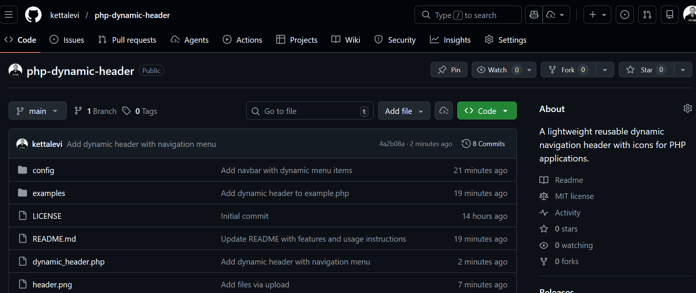

# PHP Dynamic Header

A lightweight reusable dynamic navigation header with icons for PHP applications.

## Preview



## Features

- Dynamic menu configuration
- Font Awesome icon support
- Automatic active page highlighting
- Lightweight and easy to integrate
- Simple PHP include

---

## Installation

Clone the repository:

```bash
git clone https://github.com/kettalevi/php-dynamic-header.git
```

---

## Usage

Include the header in your page:

```php
require "dynamic_header.php";
```

---

## Menu Configuration

Edit the menu items in:

```
config/menu.php
```

Example:

```php
$menu = [
    [
        "title" => "Dashboard",
        "icon" => "fa-solid fa-house",
        "link" => "index.php"
    ],
    [
        "title" => "Users",
        "icon" => "fa-solid fa-users",
        "link" => "users.php"
    ],
    [
        "title" => "Reports",
        "icon" => "fa-solid fa-chart-line",
        "link" => "reports.php"
    ]
];
```

---

## License

MIT License
